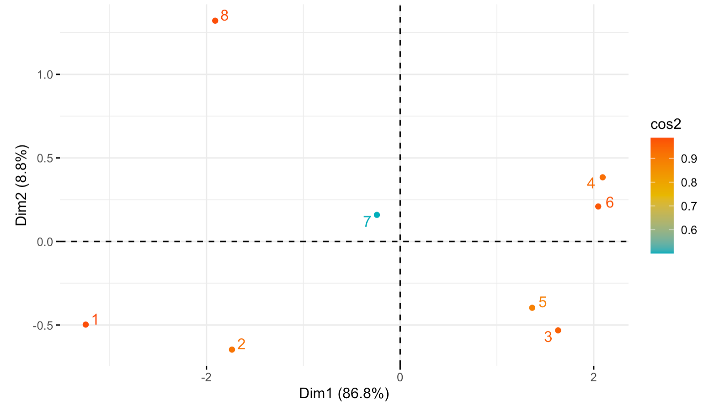
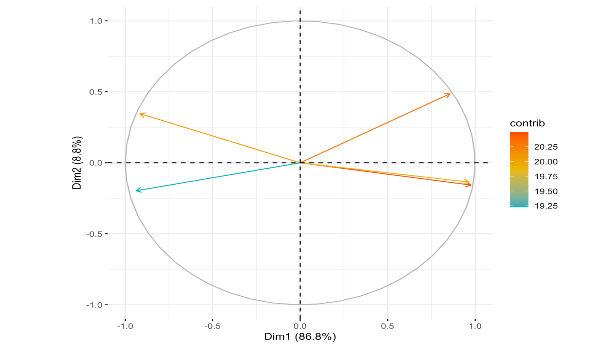

# Decision Tree Cross Validation

## Steps

### Step I
* Downloaded the *Sensor Kinetics Pro* app to your [iOS](https://itunes.apple.com/us/app/sensor-kinetics-pro/id623633248?mt=8) or [Android](https://play.google.com/store/apps/details?id=com.innoventions.sensorkineticspro&hl=en) device (or similar gyroscope measuring app)

### Step II
* Selected a physical activity that: a) can be measured using the app, b) has a concrrete, sontinuous, countable outcome and c) some members of the group are experts and some are novices at.
* Collected measurements for all members of the group performing the task using the app.
* Created a Github repo where you can store and share your data
* Used K-means to identify the novices from the experts using only the app data. According to the graph, you can see clear clusters on those that are doing well (experts) and those that are not (novices). Then when we compare with the number of push-ups each person did the clusters correspond, thus k-means does work for our activity in showing experts and novices in our group.
* Visualized the results using.

### Step III
* Devised five questions on a five point Likert scale that ask about their experience with the chosen task.
* Collected data from all members of your group.
* Ran a PCA analysis on the data.
* Visualized PC1 results for each participant.

* PC1 represents all 5 of our questions with relatively equal percentages (43.96%, 45.03%, 46.90%, 41.11%, 46.36%). PC1 composes a relatively high 86.76% (cumulative proportion) of all the variance.

### Step IV
* PC1 would be the best option for predicting the score of each member of the group, because it is more representative of each 
* A visualization that supports our conclusion

* To improve their performance, novicse could repeat the activity daily for improved result or do fast pushups in the beginning to make up for the lost energy in the end, which results in less or no pushups.
